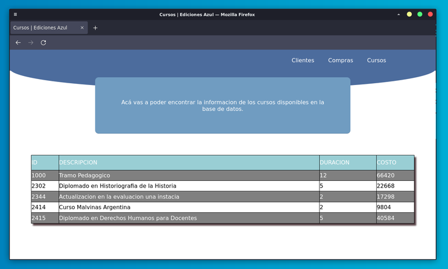

# TP Base de Datos
Cátedra de [Emanuel Odstrcil](https://github.com/alumnosifts18)

Preview web app:

Testing deploy: http://188.166.21.164:4000/data.html 

---

### Sobre el proyecto
Mediante una web app accederemos a los registros de una base de datos que creamos desde 0.

La idea es facilitar el trabajo de un vendedor de Ediciones Azul mostrando en un dashboard información relevante sobre sus clientes.

### Stack y organización

**Organización:**

- Comunicación: Discord Server
- Organización: Trello Board
- Repo: Github
- Diagramas: LucidChart [ver DER](https://lucid.app/lucidchart/e0468a62-25de-45ef-a166-972ce6dbc599/edit?viewport_loc=-128%2C26%2C2475%2C1159%2C0_0&invitationId=inv_e85e6c55-a173-4fd8-8584-22b2c5883574#)

**Stack:**

- PHP back-end [pendiente]
- MySQL
- HTML & CSS
- JS
- Cloud Database by [PlanetScale](https://planetscale.com/) [pendiente]

**Server:**

- LAMP con Docker [por Mattrayner](https://github.com/mattrayner/docker-lamp)
- Digital Ocean Droplet - 1GB
- Integración con Github Actions